# ResearchKit Workflow Diagram

Visual representation of the complete ResearchKit research process.

---

## Complete Research Workflow

```mermaid
flowchart TD
    Start([Start Research Project]) --> Init["/rk-init<br/>Initialize Project<br/>📁 Creates .researchkit/ structure"]

    Init --> Constitution["/rk-constitution<br/>Define Research Principles<br/>📜 5-7 core principles"]

    Constitution --> Question["/rk-question<br/>Refine Research Question<br/>❓ Vague → Precise & Answerable"]

    Question --> IdentifyPaths["/rk-identify-paths<br/>Identify Research Perspectives<br/>🔍 Find 3-5 disciplinary lenses"]

    IdentifyPaths --> StreamLoop{For Each<br/>Perspective}

    StreamLoop -->|Perspective 1| Stream1["/rk-create-stream<br/>Research Psychology<br/>📚 Deep dive into tradition"]
    StreamLoop -->|Perspective 2| Stream2["/rk-create-stream<br/>Research Strategy<br/>📚 Deep dive into tradition"]
    StreamLoop -->|Perspective 3| Stream3["/rk-create-stream<br/>Research Innovation<br/>📚 Deep dive into tradition"]

    Stream1 --> ResearchActivities1[During Research]
    Stream2 --> ResearchActivities2[During Research]
    Stream3 --> ResearchActivities3[During Research]

    ResearchActivities1 --> Documents1["/rk-collect-documents<br/>Organize Sources<br/>📄 Tag & categorize"]
    ResearchActivities1 --> Stories1["/rk-capture-story<br/>Capture Vivid Stories<br/>✨ Names, dates, quotes"]

    ResearchActivities2 --> Documents2["/rk-collect-documents<br/>Organize Sources<br/>📄 Tag & categorize"]
    ResearchActivities2 --> Stories2["/rk-capture-story<br/>Capture Vivid Stories<br/>✨ Names, dates, quotes"]

    ResearchActivities3 --> Documents3["/rk-collect-documents<br/>Organize Sources<br/>📄 Tag & categorize"]
    ResearchActivities3 --> Stories3["/rk-capture-story<br/>Capture Vivid Stories<br/>✨ Names, dates, quotes"]

    Documents1 --> AllStreamsComplete{All<br/>Perspectives<br/>Researched?}
    Stories1 --> AllStreamsComplete
    Documents2 --> AllStreamsComplete
    Stories2 --> AllStreamsComplete
    Documents3 --> AllStreamsComplete
    Stories3 --> AllStreamsComplete

    AllStreamsComplete -->|No| StreamLoop
    AllStreamsComplete -->|Yes| CrossStream["/rk-cross-stream<br/>Synthesize Across Perspectives<br/>🔀 Find convergence, divergence, complementarity"]

    CrossStream --> Frameworks["/rk-frameworks<br/>Extract Actionable Frameworks<br/>🎯 1-3 practitioner-ready tools"]

    Frameworks --> Write["/rk-write<br/>Generate Professional Writing<br/>✍️ Integrate evidence, stories, frameworks"]

    Write --> Output([Finished Research Output<br/>📄 Essay / Report / Guide])

    %% Styling
    classDef setupPhase fill:#e3f2fd,stroke:#1976d2,stroke-width:2px
    classDef planningPhase fill:#f3e5f5,stroke:#7b1fa2,stroke-width:2px
    classDef researchPhase fill:#fff3e0,stroke:#f57c00,stroke-width:2px
    classDef synthesisPhase fill:#e8f5e9,stroke:#388e3c,stroke-width:2px
    classDef writingPhase fill:#fce4ec,stroke:#c2185b,stroke-width:2px
    classDef decision fill:#fff9c4,stroke:#f9a825,stroke-width:2px

    class Init,Constitution setupPhase
    class Question,IdentifyPaths planningPhase
    class Stream1,Stream2,Stream3,ResearchActivities1,ResearchActivities2,ResearchActivities3,Documents1,Documents2,Documents3,Stories1,Stories2,Stories3 researchPhase
    class CrossStream,Frameworks synthesisPhase
    class Write,Output writingPhase
    class StreamLoop,AllStreamsComplete decision
```



---

## Workflow Phases Explained

### 🔵 Setup Phase (Blue)
**Commands:** `/rk-init`, `/rk-constitution`

**Goal:** Establish your research foundation and quality standards.

- **Initialize** creates your project workspace
- **Constitution** defines 5-7 principles that govern all research

**Why this order:** You need a workspace first, then quality standards before doing any research.

---

### 🟣 Planning Phase (Purple)
**Commands:** `/rk-question`, `/rk-identify-paths`

**Goal:** Transform vague questions into precise ones, identify perspectives to research.

- **Question Refinement** turns "How do companies adopt AI?" into specific, answerable questions
- **Identify Paths** finds 3-5 disciplinary perspectives (psychology, strategy, innovation, etc.)

**Why this order:** You need a precise question before you can identify which disciplines study that question.

---

### 🟠 Research Phase (Orange)
**Commands:** `/rk-create-stream`, `/rk-collect-documents`, `/rk-capture-story`

**Goal:** Deep research within each perspective, capturing evidence and stories.

- **Create Stream** guides research within ONE tradition (repeat for each perspective)
- **Collect Documents** organizes sources as you find them
- **Capture Stories** saves vivid examples with full detail

**Why this order:** You research each perspective deeply (one at a time), collecting documents and stories throughout.

**Key insight:** The loop repeats until all perspectives are researched. Stories and documents are captured continuously during this phase.

---

### 🟢 Synthesis Phase (Green)
**Commands:** `/rk-cross-stream`, `/rk-frameworks`

**Goal:** Combine insights across perspectives, extract actionable tools.

- **Cross-Stream Synthesis** finds where traditions agree, contradict, and complement each other
- **Frameworks** creates 1-3 practitioner-ready tools from synthesis

**Why this order:** Synthesis requires completing ALL perspectives first. Frameworks come from synthesis, not from single perspectives.

---

### 🔴 Writing Phase (Red)
**Commands:** `/rk-write`

**Goal:** Generate professional writing that integrates everything.

- **Write** produces essays, reports, or guides with evidence, stories, and frameworks woven together

**Why this order:** Writing is last because it needs refined questions, multi-perspective research, vivid stories, and actionable frameworks - everything created in earlier phases.

---

## Simplified Linear View

For beginners, here's the simplified sequence:


---

## Key Workflow Principles

### 1. Sequential Dependencies
Each phase depends on the previous:
- **Constitution** guides **Question refinement**
- **Question** determines which **Paths** to research
- **Paths** define which **Streams** to create
- **Streams** enable **Cross-stream synthesis**
- **Synthesis** produces **Frameworks**
- **Frameworks** power **Writing**

### 2. Parallel Activities During Research
While researching streams (Phase 3), you do three things in parallel:
- Research within the stream (`/rk-create-stream`)
- Collect documents as you find them (`/rk-collect-documents`)
- Capture stories whenever you encounter them (`/rk-capture-story`)

### 3. The Loop
The research phase loops for each perspective:
```
For each of 3-5 perspectives:
    1. Create stream for this perspective
    2. Research deeply within this tradition
    3. Collect documents throughout
    4. Capture stories throughout
    → Repeat until all perspectives complete
```

### 4. No Skipping
**You cannot skip steps.** Each builds on the previous:
- Can't refine questions without a constitution
- Can't identify paths without a refined question
- Can't synthesize without multiple streams
- Can't extract frameworks without synthesis
- Can't write compellingly without frameworks and stories

---

## Optional: Gemini for Large Documents

When documents are too large for Claude's context window:


**See [Gemini Setup Guide](gemini-setup.md) for installation.**

---

## Utility Commands (Use Anytime)

These commands can be used at any point:

- **`/rk-validate`** - Check if ResearchKit is healthy (troubleshooting)
- **`/rk-find-stories`** - Search your story library (useful when writing)

---

## Complete Workflow Command

**Don't want to remember all these steps?**

Use `/rk-research` to be guided through the entire workflow from start to finish.


**Recommendation:** Use `/rk-research` for your first project to learn the workflow. After you understand it, use individual commands for speed.

---

## Example: Real Research Project

Here's how the workflow looks for a real project:


**Time investment:** 10-20 hours spread over days/weeks.

---

## Back to Documentation

- **[Getting Started Guide](getting-started.md)** - Step-by-step walkthrough
- **[Commands Reference](commands-reference.md)** - All 13 commands explained
- **[README](../../README.md)** - Main documentation
